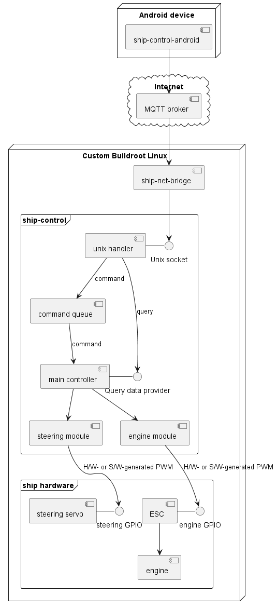
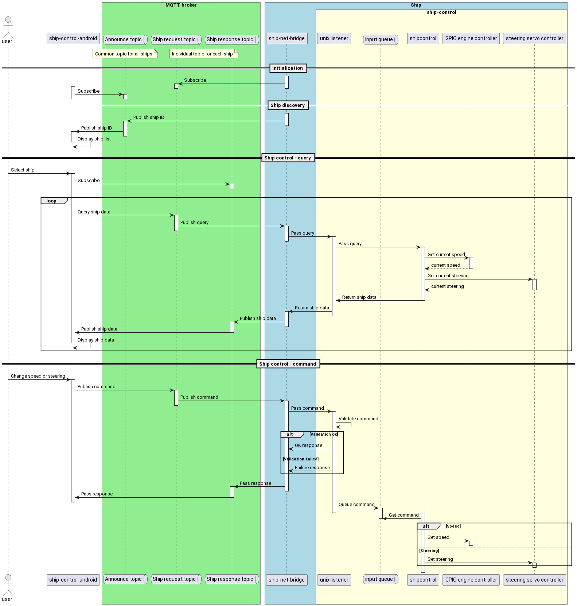

# Ship-control architecture

## Components
Ship remote control S/W consists of the following main components:

1. Mobile application. Visualizes current ship data and provides control capabilities.
2. MQTT broker connecting mobile application with the ship.
3. Ship S/W receiving commands and queries from MQTT broker, controlling speed and steering of the ship.

The following diagram depicts ship-control components and their interactions:

### ship-control-android
Android application providing GUI for remote ship control. Uses MQTT broker to send commands/queries to the ship and receive responses.

### ship-net-bridge
Ship-side network bridge. Connects to MQTT broker and relays messages between the broker and unix socket opened by ship-control process.

### ship-control
Manages ship hardware using Pololu Maestro controller and ESC units (one or more). Maestro controller is connected via USB, ESC units are connected using GPIO lines.

Maestro controller is used to control steering servos.

ESCs manage engines.

ship-control uses either H/W or S/W PWM signals to control ESCs or a combination of both depending on the particular RaspberryPi board model and configuration (older revisions support only 1 H/W PWM GPIO line). H/W PWM is preferred due to much higher frequency setting precision.

ship-control listens to Unix socket for external communications. Commands received from the network bridge are queued for internal processing in the order of reception. Queries are handled synchronously.

## Control sequence

1. ship-net-bridge connects to MQTT broker and subscribes to the ship request topic (individual topic for each ship)
2. ship-control-android subscribes to the common announce topic
3. ship-net-bridge publishes ship ID on the announce topic every N seconds (N is configurable)
4. ship-control-android receives ship ID on the announce topic and displays ship list to the user
5. Once the user selects ship, ship-control-android subscribes to the response topic for the selected ship
6. ship-control-android starts querying ship data. It publishes queries on the ship request topic
7. ship-net-bridge relays queries to the unix socket listened by ship-control
8. ship-control's unix handler uses main control module to fetch current ship data and passes it back to ship-net-bridge
9. ship-net-bridge publishes ship data on the ship response topic
10. ship-control-android reads ship data from the response topic and displays it
11. Once the user changes speed or steering, ship-control-android publishes command on the ship request topic
12. ship-net-bridge relays command to the unix socket of ship-control
13. ship-control's unix handler validates incoming command. If validation is successfull, it passes command to internal queue for processing. If validation fails, it sends negative response to ship-net-bridge, which relays it to ship-control-android through the ship response topic
14. ship-control's main module constantly queries internal command queue. Once new command is received, it handles it by adjusting speed or steering.
